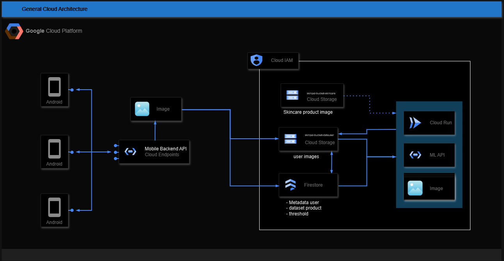

# SkinPal API with Python

## Deskripsi
API ini dibangun menggunakan FastAPI untuk mengelola penyimpanan pengguna dan analisis kulit menggunakan Google Cloud Storage dan Firestore.


## Team Member - CC

| Bangkit ID | Name | Learning Path | University |LinkedIn |
| ---      | ---       | ---       | ---       | ---       |
| C312B4KY1672 | Haidar Dzaky Musyaffa  | Cloud Computing| Universitas Sebelas Maret | [](https://www.linkedin.com/in/haidar-dzaky-musyaffa-6aa688269) |
| C312B4KY1432 | Fathin Achmad Ashari| Cloud Computing | Universitas Sebelas Maret | [](https://www.linkedin.com/in/fathin-achmad-ashari) |


## Technology Stack

SkinPal dibangun menggunakan teknologi-teknologi berikut:

### Backend Framework & Server
- **FastAPI** (v0.104.1): Framework Python modern untuk membangun API dengan performa tinggi

> Lihat [Dokumentasi API](https://skinpal-api-backend-989761954410.asia-southeast2.run.app/docs) lengkap
- **Uvicorn** (v0.24.0): Server ASGI yang ringan dan cepat untuk Python

### Database & Storage
- **Google Cloud Firestore** (v2.13.1): Database NoSQL untuk penyimpanan data terstruktur
- **Google Cloud Storage** (v2.13.0): Layanan penyimpanan objek untuk gambar dan file
- **Firebase Admin** (v6.2.0): SDK Admin untuk manajemen Firebase/Google Cloud

### Machine Learning & Image Processing
- **TensorFlow** (≥2.13.0): Framework machine learning untuk analisis kulit
- **NumPy** (≥1.24.3): Library untuk komputasi numerik
- **Pillow** (≥10.0.0): Library pengolahan gambar Python
- **Pandas** (≥1.5.0): Library analisis data untuk Python

### Keamanan & Autentikasi
- **Python-Jose** (v3.3.0): Implementasi JWT (JSON Web Tokens) untuk Python
- **Bcrypt** (v3.2.0): Library untuk hashing password
- **Pydantic** (v2.4.2): Data validation menggunakan Python type annotations

### Utilitas
- **Python-Multipart** (v0.0.6): Parser untuk form-data/multipart
- **OpenPyxl** (v3.1.2): Library untuk membaca/menulis file Excel
- **Python-Dotenv** (v0.19.0): Manajemen environment variables

## Prerequisites
Sebelum memulai, pastikan Anda memiliki:
- **Python 3.7** atau **lebih baru**
- Pip (package installer untuk Python), rekomendasi version **pip 24.3.1** 

## Instalasi

1. **Clone Repositori**
   ```bash
   git clone https://github.com/SkinPal/CC-API-Development.git
   ```
1. **Check Version Python ( harus > 3.7) dan Pip**
   ```bash
   python --version
   pip --version
   ```
   Jika masih belum sesuai dengan prerequisites, harap sesuaikan dahulu.

3. **Instal Dependensi**
   ```bash
   pip install -r requirements.txt
   ```
4. **Run Program Lokal**
   ```bash
   uvicorn app.main:app --host localhost --reload
   ```

## Aplikasi akan berjalan di `http://localhost:8000`. Anda dapat mengakses dokumentasi API di `http://localhost:8000/docs`.

## Penggunaan
- Untuk mengupload gambar, gunakan endpoint `/api/v1/users/upload`.
- Untuk menghapus gambar, gunakan endpoint `/api/v1/users/delete-image`.
- Untuk mendapatkan data analisis kulit, gunakan endpoint `/api/v1/users/analysis`.

user register :
=======
## User Register ##
```
{
    "user_id": "user1",
    "nama": "Ahmad Cristian",
    "email": "ahmadcristian@email.com"
}
```

## Cloud Storage Bucket Architecture ##
```bash
storage-bucket-01/
├── [user1_id]/
│   ├── pekan1/
|   |   ├── user1_pekan1.jpg  
│   ├── pekan2/
│   ├── pekan3/
│   └── pekan4/
│   └── profile/
│   └── test/
└── [user2_id]/
    ├── pekan1/
    ├── pekan2/
    ├── pekan3/
    └── pekan4/
    └── profile/
    └── test/
```

## Firestore Architecture ##
```bash
skinpal-firestore(default)/
└── pengguna/
    ├── [user1_id]/
    │   ├── nama: "Ahmad Cristian"
    │   ├── email: "ahmadcristian@email.com"
    │   ├── password: (hashed)
    │   ├── profile_url: null
    │   ├── createdAt: timestamp
    │   └── image/
    │       ├── pekan0/
    │       │   ├── tipe_kulit: null
    │       │   ├── acne: null
    │       │   ├── redness: null
    │       │   ├── eyebags: null
    │       │   ├── score: null
    │       │   ├── createdAt: null
    │       │   ├── public_url: null
    │       ├── pekan1/
    │       ├── pekan2/
    │       ├── pekan3/
    │       └── pekan4/
    └── [user2_id]/
        ├── nama: "User 2 Name"
        ├── email: "user2@email.com"
        ├── createdAt: timestamp
        └── image/
            ├── pekan0/
            ├── pekan1/
            ├── pekan2/
            ├── pekan3/
            └── pekan4/

```

## Cloud Architecture 



